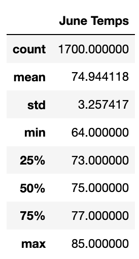
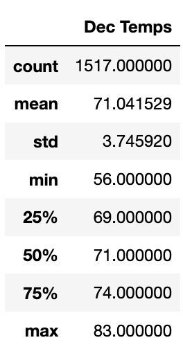
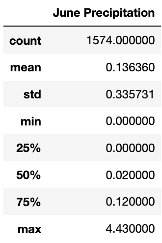
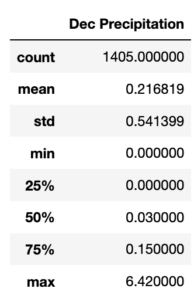

# Surf's Up with Advanced Data Storage and Retrieval

## Overview of Analysis

In order to get a better understanding whether or not W. Avy should have their surf shop/ice cream business open year round, further analyses have been made on weather data in Oahu for the months of June and December.

## Resources

- Data Source: hawaii.sqlite
- Software: Python 3.7.11, Jupyter Notebook 6.4.5

## Results

Looking at the results for both June and December one can see the following:
  - The average temperature in Oahu only varies by roughly 3-4°
  - The low temperature for June is 8° warmer compared to December's low of 56°
  - The high temperature for June is only 2° warmer compared to December's high of 83°




The data for this analysis was made possible by executing the following code:

```python
june_results = session.query(Measurement.tobs).filter(extract('month', Measurement.date) == 6).all()
june_temps = list(np.ravel(june_results))
june_temps_df = pd.DataFrame(june_temps, columns=['June Temps'])
june_temps_df.describe()
```

Similar code was created for December as well. The code above starts by querying the session. The session is based on the hawaii.sqlite database meanwhile `Measurement` is a class within the database and `tobs` is a specific table of data within that class. So, by filtering the `tobs` data by extracting all instances of when the `date` table is 6 aka June, we are able to put all of that data into a data frame in order to run analyses more easily.

## Summary

Two extra queries were performed in order to get a better understanding of the overall weather for June and December. Precipitation data was queried and the results can be seen below:




One can see that overall, December looks to be slightly rainier compared to June.

In summary, temperatures in Oahu look to remain fairly steady with less rainfall in the middle of the year. Fall and winter seasons will see a slight decline in temperature as well as a slight increase in rain.
